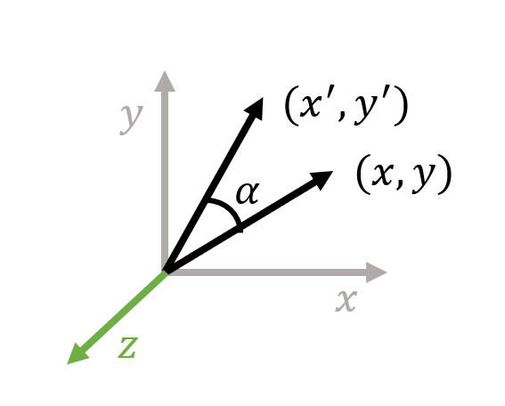

# 旋转的表示
:label:`sec_rotation-representation`

在模拟一个物理世界之前，我们首先需要理解如何表示这一个物理世界，表示物体的所处的状态。

对于一个三维空间内的刚体而言，其拥有六个自由度，三个自由度来源于物体沿着前后、上下、左右三个相互垂直方向进行平移运动，剩余三个自由度来源于物体沿着前后、上下、左右三个相互垂直的坐标轴的进行旋转。

前三个表示位置的自由度我们可以使用物体质心，同三维坐标系原点之间的相对位移的向量 $(x, y, z)$ 来表示。后三个表示物体旋转的自由度的表示方法则较为多样，下文我们会依次描述。

## 旋转矩阵
:label:`sec_rotation_matrix`

### 二维旋转矩阵

我们先回顾一下二维空间内的旋转。如 :numref:`fig_animation-rotation_2d` 所示，二维空间内的旋转仅有一个自由度。

:width:`400px`
:label:`fig_animation-rotation_2d`

因而我们不妨假设通过该旋转，平面上的向量 $(x, y)$ 绕着原点逆时针旋转 $\alpha$ 弧度，得到旋转后的向量 $(x', y')$。假定 $(x, y)$ 是由沿着 $x$ 轴正方向长度为 $r$ 的向量，绕着原点逆时针旋转 $\theta$ 弧度得到的，据此可以列出方程：

$$ \begin{aligned} &x = r \cos \theta，\\ &y = r \sin \theta，\\ &x' = r \cos (\theta + \alpha)，\\ &y' = r \sin (\theta + \alpha)。\end{aligned} $$

利用三角函数和差公式，则可以得到:

$$ \begin{aligned} &x' = r \cos \theta \cos \alpha - r \sin \theta \sin \alpha = x \cos \alpha - y \sin \alpha，\\ &y' = r \sin \theta \cos \alpha + r \cos \theta \sin \alpha = x \sin \alpha + y \cos \alpha。\end{aligned} $$
:eqlabel:`eq_animation-2drot_formulation`

因而我们可以将式 :eqref:`eq_animation-2drot_formulation` 写成矩阵乘法的形式：

$$ \begin{pmatrix}x' \\ y'\end{pmatrix}=\begin{pmatrix}\cos\alpha & -\sin\alpha \\ \sin\alpha & \cos\alpha\end{pmatrix}\begin{pmatrix}x \\ y\end{pmatrix}。$$

### 绕轴旋转矩阵

在三维空间内，不妨首先考虑绕着 $z$ 轴进行的旋转。假设旋转前向量为 $\mathbf{P}_0 = (x, y, z)^\top$，旋转后向量为 $\mathbf{P}_0' = (x', y', z')^\top$。

:width:`400px`
:label:`fig_animation-rotation_along_axis_z`

对于 $z$ 分量，由于 $z$ 分量在绕 $z$ 轴旋转时保持不变，因此 $z' = z$。对于 $xy$ 分量，由于 $z$ 分量保持不变，因此向量旋转方式等同于在 $xy$ 平面上进行的二维旋转。据此我们可以得到矩阵形式：

$$ \begin{pmatrix}x' \\ y' \\ z'\end{pmatrix}=\begin{pmatrix}\cos\alpha & -\sin\alpha & 0 \\ \sin\alpha & \cos\alpha & 0 \\ 0 & 0 & 1\end{pmatrix}\begin{pmatrix}x \\ y \\ z\end{pmatrix}。$$
:eqlabel:`eq_animation-matrix_along_z`

类比于绕 $z$ 轴旋转的情况，我们可以分别得到绕 $x$ 轴、绕 $y$ 轴旋转的矩阵表示：

$$ \begin{pmatrix}x' \\ y' \\ z'\end{pmatrix}=\begin{pmatrix}1 & 0 & 0 \\ 0 & \cos\alpha & -\sin\alpha \\ 0 & \sin\alpha & \cos\alpha\end{pmatrix}\begin{pmatrix}x \\ y \\ z\end{pmatrix}，$$
:eqlabel:`eq_animation-matrix_along_x`

$$ \begin{pmatrix}x' \\ y' \\ z'\end{pmatrix}=\begin{pmatrix}\cos\alpha & 0 & \sin\alpha \\ 0 & 1 & 0 \\ -\sin\alpha & 0 & \cos\alpha\end{pmatrix}\begin{pmatrix}x \\ y \\ z\end{pmatrix}。$$
:eqlabel:`eq_animation-matrix_along_y`

将绕 $z, x, y$ 轴进行旋转的矩阵分别记为 $\mathbf R_z(\alpha),\mathbf R_x(\alpha),\mathbf R_y(\alpha)$，则式 :eqref:`eq_animation-matrix_along_z`, :eqref:`eq_animation-matrix_along_x`, :eqref:`eq_animation-matrix_along_y` 可以分别简写为:

$$ \begin{aligned}&\mathbf R_z(\alpha)\mathbf P_0=\mathbf P_0'，\\ &\mathbf R_x(\alpha)\mathbf P_0=\mathbf P_0'，\\ &\mathbf R_y(\alpha)\mathbf P_0=\mathbf P_0'。\end{aligned} $$

### 三维正交变换

我们已经推导完毕了三维空间内绕坐标轴的旋转矩阵，但是对于不是绕着坐标轴进行的旋转仍然无能为力。因此我们考虑对空间进行正交变换，使得变换后的空间内旋转轴恰好为三维旋转中的某一个。

我们不妨考虑从正交坐标系 $xyz$ 变换到另一个正交坐标系 $x'y'z'$，如 :numref:`fig_animation-rotation_steps_a` 所示。我们希望能够构建矩阵 $\mathbf R$，使得其满足：

$$ \begin{pmatrix}x' \\ y' \\ z'\end{pmatrix}=\mathbf R\begin{pmatrix}x \\ y \\ z\end{pmatrix}。$$

我们考虑怎么求解矩阵 $\mathbf R$。

为了将沿 $x$ 轴正方向的单位向量 $\mathbf{e}_x = (1, 0, 0)^\top$ 变换到 $x'$ 下，我们不难发现，旋转矩阵 $\mathbf R$ 第一列的取值，恰好为 $xyz$ 坐标系下沿着 $x'$ 正方向单位向量的取值 $\mathbf{e}_x'$。类似的，我们可以说明旋转矩阵 $\mathbf R$ 的第二，三列的取值，分别为$xyz$ 坐标系下沿着 $y', z'$ 正方向单位向量的取值 $\mathbf{e}_y', \mathbf{e}_z'$。据此我们有：

$$ \mathbf R=\begin{pmatrix}\mathbf e_x' & \mathbf e_y' & \mathbf e_z'\end{pmatrix}。$$

如果我们从变换后的正交坐标系 $x' y' z'$ 变回正交坐标系 $xyz$，则我们需要求解 $\mathbf R^{-1}$。由于矩阵 $\mathbf R$ 的每一列模长均为 $1$，且根据正交坐标系的性质知道 $\mathbf{e}_x', \mathbf{e}_y', \mathbf{e}_z'$ 三者相互垂直，因此我们不难证明 $\mathbf{R^\top R = I}$。因此 $\mathbf R$ 必然为正交矩阵，$\mathbf R^{-1} = \mathbf R^{\top}$。

正交矩阵有如下几种性质：

- 每一列代表变换后对应的坐标轴。

- 所有列向量均为单位向量，列向量之间两两正交。

- 假设 $\mathbf A$ 为正交矩阵，则 $\mathbf A^{-1} = \mathbf A^\top, \mathbf{AA^\top = I}, \mathbf A$ 的行列式值为 $\pm 1$。

- 假设 $\mathbf{A, B}$ 为正交矩阵, 则 $\mathbf{A^\top, AB}$ 也是正交矩阵。

经过检查，我们发现式 :eqref:`eq_animation-matrix_along_z`, :eqref:`eq_animation-matrix_along_x`, :eqref:`eq_animation-matrix_along_y` 中的矩阵均为正交矩阵。

### 三维旋转矩阵

我们已经知道如何用矩阵表达绕坐标轴的旋转了，现在我们进一步来表达绕任意轴的旋转。假定我们需要绕旋转轴 $\mathbf u$ 旋转 $\alpha$ 弧度，利用已有的知识，我们可以尝试给出如下的解法：

- 通过旋转轴构造正交坐标系 $x'y'z'$, 使得 $x'$ 恰好为 $\mathbf u$。

- 将正交坐标系 $x'y'z'$ 变换为正交坐标系 $xyz$, 此时旋转轴 $\mathbf u$ 经过变换后恰好为 $x$ 轴。

- 绕着 $x$ 轴旋转 $\alpha$ 弧度。

- 将正交坐标系 $xyz$ 变换回 $x'y'z'$。

:width:`400px`
:label:`fig_animation-rotation_steps_a`

:width:`400px`
:label:`fig_animation-rotation_steps_b`

:width:`400px`
:label:`fig_animation-rotation_steps_c`

此时我们只需要构造出满足条件的正交坐标系 $x'y'z'$：

- 取任一单位向量 $\mathbf t$, 其与 $\mathbf u$ 不共线。

- 取 $\mathbf{w = t \times u}$, 此时有 $\mathbf {t, w}$ 垂直。

- 取 $\mathbf{v = u \times w}$, 此时有 $\mathbf{u, w, v}$ 三者两两垂直。

此时由向量 $\mathbf{u,v,w}$ 诱导出的坐标系 $uvw$ 正交，因此可以取正交坐标系 $x'y'z'$ 为正交坐标系 $uvw$，经验证其满足所有约束条件。

假定从正交坐标系 $xyz$ 变换到正交坐标系 $x'y'z'$ 的正交变换矩阵为 $\mathbf R = \begin{pmatrix}\mathbf u & \mathbf v & \mathbf w\end{pmatrix}$。设旋转前向量坐标为 $\mathbf{P}_0$, 旋转后向量坐标为 $\mathbf{P}_0'$, 则有恒等式：

$$ \mathbf{P}_0' = \mathbf R \mathbf R_x(\alpha) \mathbf R^\top \mathbf{P}_0。 $$

据此，绕旋转轴 $\mathbf u$ 旋转 $\alpha$ 弧度的旋转矩阵为 $\mathbf R \mathbf R_x(\alpha) \mathbf R^\top$。

事实上，根据**罗德里格旋转公式（Rodrigues' rotation formula）**，存在一个更为直接的旋转矩阵求解方法。假定我们需要绕旋转轴 $\mathbf u$ 旋转 $\alpha$ 弧度，则旋转矩阵 $\mathbf R$ 满足：

$$ \mathbf R = \mathbf I + \sin \alpha [\mathbf u]_{\times} + (1 - \cos \alpha) [\mathbf u]_{\times}^2， $$
:eqlabel:`eq_animation-rodrigues`

其中 $[\mathbf u]_\times=\begin{pmatrix}0 & -u_z & u_y \\ u_z & 0 & -u_x \\ -u_y & u_x & 0\end{pmatrix}$。

## 四元数

### 二维平面复数

对于一个复数，其可以被记为 $z = x + y\mathrm{i} \in \mathbb{C}$，其中 $x, y \in \mathbb{R}$，$\mathrm{i}^2 = -1$。我们将该复数与平面上的向量 $(x,y)$ 做一一对应。

**欧拉公式（Euler's formula）**告诉我们，对于一个复数 $z$，其可以表示成 $z = r\mathrm{e}^{\mathrm{i}\theta} = r(\cos \theta + \mathrm{i} \sin \theta)$ 这两种等价的形式。因此我们可以得到，逆时针将向量 $(x,y)$ 旋转 $\alpha$ 弧度后得到的向量以复数形式可以表示为 $r\mathrm{e}^{\mathrm{i}(\theta+\alpha)}$。于是我们有

$$ r\mathrm{e}^{\mathrm{i}(\theta+\alpha)} = \mathrm{e}^{\mathrm{i}\alpha}\cdot r\mathrm{e}^{\mathrm{i}\theta}。 $$
:eqlabel:`eq_animation-euler_2d_rotation_complex`

而由式 :eqref:`eq_animation-euler_2d_rotation_complex` 我们可以得出：单位复数 $\mathrm e^{\mathrm i\alpha}$ 表示绕着原点逆时针旋转 $\alpha$ 弧度的旋转。

### 四元数定义与运算

:width:`400px`
:label:`fig_animation-quaternion_hamilton`

定义四元数 $q = a + b\mathrm{i} + c\mathrm{j} + d\mathrm{k}$，其中 $a, b, c, d \in \mathbb{R}$。类比于二维复数运算，四元数虚部同样满足 $\mathrm{i}^2 = \mathrm{j}^2 = \mathrm{k}^2 = -1$。

四元数虚部 $\mathrm{i,j,k}$ 相互的运算法则可以类比于三维空间上的叉积运算，$\mathrm{i,j,k}$ 分别对应 $x,y,z$ 轴上的单位向量。据此我们可以得到如下运算法则：

$$ \begin{array}{lll} \mathrm{i}\mathrm{j} = \mathrm{k}， & \mathrm{j}\mathrm{k} = \mathrm{i}， & \mathrm{k}\mathrm{i} = \mathrm{j}， \\ \mathrm{j}\mathrm{i} = -\mathrm{k}， & \mathrm{k}\mathrm{j} = -\mathrm{i}， & \mathrm{i}\mathrm{k} = -\mathrm{j}。 \end{array} $$

:width:`400px`
:label:`fig_animation-quaternion_with_coordinate`

由于四元数虚部运算规则与三维向量叉积几乎相同，因此四元数也可以表示成实部 $w = a$ 和虚部向量 $\mathbf{v} = (b, c, d)^\top$ 拼接而成的形式，记作 $[w, \mathbf{v}]$。

四元数的加减法、模长、数乘、点乘运算法则与传统的四维向量运算规则类似。假定 $q_1 = a_1 + b_1\mathrm{i} +c_1\mathrm{j} + d_1\mathrm{k} = 
[w_1, \mathbf{v}_1]$，$q_2 = a_2 + b_2\mathrm{i} +c_2\mathrm{j} + d_2\mathrm{k} = 
[w_2, \mathbf{v}_2]$，则运算规则如下：

$$ \begin{aligned}q_1\pm q_2 &= (a_1\pm a_2)+(b_1\pm b_2)\mathrm i+(c_1\pm c_2)\mathrm j+(d_1\pm d_2)\mathrm k， \\ tq_1 &= ta_1+tb_1\mathrm i+tc_1\mathrm j+td_1\mathrm k， \\ q_1\cdot q_2 &= a_1a_2+b_1b_2+c_1c_2+d_1d_2， \\ \|q_1\|_2 &= \sqrt{q_1\cdot q_1}。\end{aligned} $$

对于四元数的乘法运算，由于我们已经知道了虚部两两相乘的结果，因此我们可以对其作暴力展开成 $16$ 项：

$$ \begin{array}{llll} q_1q_2 & = & &(a_1 + b_1\mathrm{i} +c_1\mathrm{j} + d_1\mathrm{k})(a_2 + b_2\mathrm{i} +c_2\mathrm{j} + d_2\mathrm{k})\\ & = & &  (a_1a_2 - b_1b_2 - c_1c_2 - d_1d_2) \\ & & + &  (a_1b_2 + b_1a_2 + c_1d_2 - d_1c_2)\mathrm{i} \\  & & + &  (a_1c_2 - b_1d_2 + c_1a_2 + d_1b_2)\mathrm{j} \\ & & + &  (a_1d_2 + b_1c_2 - c_1b_2 + d_1a_2)\mathrm{k}。 \end{array} $$

为了简便起见，我们一般使用实部与虚部向量的方式表示四元数乘法：

$$ q_1q_2 = [w_1w_2 - \mathbf{v}_1 \cdot \mathbf{v}_2, w_1 \mathbf{v}_2 + w_2 \mathbf{v}_1 + \mathbf{v}_1 \times \mathbf{v}_2]。 $$

四元数的共轭定义与复数共轭定义类似，均为将虚部取反的结果。例如四元数 $q = [w,\mathbf{v}]$ 的共轭则为 $q^{\star} = [w,-\mathbf{v}]$。

利用四元数乘法与共轭运算的定义，我们不难得出 $qq^{\star} = [w^2 + \mathbf{v} \cdot \mathbf{v},\mathbf 0] = \|q\|^2$。 因此我们可以构造任意非零四元数 $q$ 的逆元为 $q^{-1} = \frac{q^{\star}}{\|q\|^2}$。与复数的逆元类似，四元数的逆元同样满足 $qq^{-1} = q^{-1}q = [1, \mathbf 0]$。

定义单位四元数为所有模长为 $1$ 的四元数，也就是所有位于四维超球面上的四元数。根据定义不难得出单位 $q$ 满足 $q^{-1} = q^{\star}$。类似于单位复数的分解 $z = \cos \theta + \sin \theta \mathrm{i}$，我们对于单位四元数也可以做同样的虚部实部分解 $q = [\cos \theta, \mathbf{u} \sin \theta]$，其中 $\mathbf{u}$ 是单位三维向量。

### 四元数表示旋转

接下来我们通过如下结论指出四元数和三维旋转变换的对应关系：

假定 $q = [\cos \theta, \mathbf{u} \sin \theta]$ 是一个单位四元数，其中 $\mathbf{v}$ 是三维空间内的单位向量，$v = [0, \mathbf{v}]$ 是一个实部为 $0$ 的四元数。则有：

- $qvq^{\star}$ 实部为 $0$。

- $qvq^{\star}$ 虚部为向量 $\mathbf{v}$ 绕旋转轴 $\mathbf{u}$ 旋转弧度 $2\theta$ 后的结果。

为证明这个结论，我们可以将向量 $\mathbf{v}$ 分解为平行于旋转轴 $\mathbf{u}$ 以及与旋转轴正交(垂直) 的两个分量 $\mathbf{v}_{\|}$ 和 $\mathbf{v}_{\perp}$。接下来我们只需要说明，平行分量在进行上述变换后保持不变，垂直分量在进行上述变换后等价于在与垂直于旋转轴 $\mathbf{u}$ 的平面内逆时针旋转了 $2\theta$ 弧度即可。

:width:`400px`
:label:`fig_animation-rotation_quaternion_a`

:width:`400px`
:label:`fig_animation-rotation_quaternion_b`

:width:`400px`
:label:`fig_animation-rotation_quaternion_c`

首先我们证明平行分量在进行上述变换后保持不变，且实部为 $0$ 。不妨假设 $\mathbf{v} = \mathbf{u}$，则根据四元数乘法规则有：

$$ \begin{array}{lll} qvq^{\star} & = & (\cos \theta + \mathbf{u} \sin \theta)(0 + \mathbf{u})(\cos \theta - \mathbf{u} \sin \theta) \\ & = & (- \mathbf{u} \cdot \mathbf{u} \sin \theta + \mathbf{u} \cos \theta)(\cos \theta - \mathbf{u} \sin \theta) \\ & = & (- \sin \theta + \mathbf{u} \cos \theta)(\cos \theta - \mathbf{u} \sin \theta) \\ & = & - \sin \theta \cos \theta + \mathbf{u} \cos \theta \cdot \mathbf{u} \sin \theta + ((-\sin \theta) ^ 2 + (\cos \theta)^2) \mathbf{u}\\ & = & 0 + \mathbf{u}。 \end{array} $$

这说明平行分量在进行上述变换后保持不变，且实部为 $0$。

之后我们证明垂直分量在进行上述变换后等价于在与垂直于旋转轴 $\mathbf{u}$ 的平面内逆时针旋转了 $2\theta$ 弧度。根据假设我们有 $\mathbf{v} \cdot \mathbf{u} = 0$。取单位向量 $\mathbf{w} = \mathbf{u} \times \mathbf{v}$, 则 $\mathbf{w} \cdot \mathbf{v} = \mathbf{w} \cdot \mathbf{u} = 0$。据此有：

$$ \begin{array}{lll} qvq^{\star} & = & (\cos \theta + \mathbf{u} \sin \theta)(0 + \mathbf{v})(\cos \theta - \mathbf{u} \sin \theta) \\ & = & (\mathbf{v} \cos \theta + \mathbf{w} \sin \theta)(\cos \theta - \mathbf{u} \sin \theta) \\ & = & \mathbf{v} \cos^2 \theta + \mathbf{w} \sin \theta \cos \theta - \mathbf{v} \cos \theta \times \mathbf{u} \sin \theta - \mathbf{w} \sin \theta \times \mathbf{u} \sin \theta \\ & = & \mathbf{v} (\cos^2 \theta - \sin^2 \theta) + \mathbf{w} 2\sin \theta \cos \theta \\
& = & \mathbf{v} \cos 2\theta + \mathbf{w} \sin 2\theta。 \end{array} $$

这说明垂直分量在进行上述变换后等价于在与垂直于旋转轴 $\mathbf{u}$ 的平面内逆时针旋转了 $2\theta$ 弧度，且实部为 $0$。

由于任意向量 $\mathbf{v}$ 均可以分解成关于旋转轴 $\mathbf{u}$ 的垂直分量和平行分量线性叠加的结果，因此 $qvq^{\star}$ 实部必然为 $0$，虚部必然为向量 $\mathbf{v}$ 绕旋转轴 $\mathbf{u}$ 旋转弧度 $2\theta$ 后的结果，结论得证。

根据上述结论，对于将向量 $\mathbf{v}$ 沿着单位长度旋转轴 $\mathbf{u}$ 旋转 $\theta$ 弧度的问题，可以按如下方式处理：

- 构造四元数 $q = \cos \frac{\theta}{2} + \mathbf{u} \sin \frac{\theta}{2}$，$v = [0, \mathbf{v}]$。

- $qvq^{\star}$ 的虚部即为旋转后得到的结果。

同时，由于对于任意四元数 $q,v$，$qvq^{\star} = (-q) v (-(q^{\star})) = (-q) v (-q)^{\star}$ 恒成立，因此单位四元数 $q$ 和 $-q$ 表示的是一样的旋转。

假定我们要对向量 $\mathrm{v}$ 顺次进行单位四元数 $q_1$ 和 $q_2$ 所表示的旋转操作，则其结果为 $q_2(q_1vq_1^\star)q_2^{\star}$。类比于复数共轭运算的性质，我们不难得出 $(q_2q_1)^\star = q_1^\star q_2^\star$，因此上式可以进一步简化为 $(q_2q_1)v(q_2q_1)^{\star}$。因此，先进行单位四元数 $q_1$ 表示的旋转，再进行单位四元数 $q_2$ 表示的旋转，复合之后旋转的四元数表示即为 $q_2q_1$。

### 四元数插值

给定两个单位四元数 $p, q$，和一个参数 $t \in [0, 1]$, 我们希望能够找到这么一个中间四元数 $r(p, q, t)$ 作为插值结果，使得当 $t$ 取值从 $0$ 变为 $1$ 的时候，$r(p, q, t)$ 取值能够平滑地从 $p$ 过渡到 $q$。对于二元插值问题，常用的解法是取 $r(t, p, q) = a(t)p + b(t)q$ ，使用 $p, q$ 的加权求和作为插值结果。

:width:`400px`
:label:`fig_animation-quaternion_interpolation_a`

:width:`400px`
:label:`fig_animation-quaternion_interpolation_b`

最简单的构造方法是进行线性插值，也就是取 $a(t) = 1-t, b(t) = t$。此时 $r(p, q, t) = (1-t)p + tq$。但是线性插值效果并不理想。一方面，线性插值的结果都落在四维超球面的二维弦上，因此插值结果不一定是单位四元数。即使通过归一化将结果变为单一四元数，但是其在球面上的运动速度并不均匀。不难得出当 $t$ 在 $[0,1]$ 内匀速运动时，归一化之前四元数模长越小，归一化后其在球面上的运动速度越快。

另外一种想法是在四维超球面上进行线性插值。假定 $p, q$ 之间的夹角为 $\theta$，也即 $\cos \theta = p \cdot q$, 我们找出球面上位于 $p, q$ 连线上的点 $r$, 使得 $p \cdot r = \cos(t\theta)$, $q \cdot r = \cos [(1-t)\theta]$，此时球面上的线性插值就可以克服普通线性插值的所有问题。仍然假设 $r = a(t)p + b(t)q$, 我们考虑如何求解 $a(t)$ 和 $b(t)$ 的取值。

对插值公式两侧点乘 $p$，得到：

$$ \begin{aligned}r\cdot p &= a(t)p\cdot p+b(t)q\cdot p， \\ \cos(t\theta) &= a(t)+b(t)\cos\theta。\end{aligned} $$
:eqlabel:`eq_animation-slerp1`

对插值公式两侧点乘 $q$，得到：

$$ \begin{aligned}r\cdot q &= a(t)p\cdot p+b(t)q\cdot q， \\ \cos[(1-t)\theta] &= a(t)\cos\theta+b(t)。\end{aligned} $$
:eqlabel:`eq_animation-slerp2`

联立方程 :eqref:`eq_animation-slerp1` 和 :eqref:`eq_animation-slerp2`，解得：

$$ \begin{aligned}& a(t) = \frac{\cos t\theta - \cos[(1-t)\theta] \cos \theta}{1 - \cos^2 \theta} = \frac{\sin [(1-t) \theta]}{\sin \theta}， \\ & b(t) = \frac{\cos [(1-t)\theta] - \cos t\theta \cos \theta}{1 - \cos^2 \theta} = \frac{\sin t \theta}{\sin \theta}。\end{aligned} $$

这种插值方式即为球面线性插值，可以简记为如下形式：

$$ \mathrm{Slerp}(p, q, t) = \frac{\sin [(1-t)\theta] p + \sin t\theta q}{\sin \theta}。 $$

## 欧拉角

任何三维旋转实际上都可以分解成三个基本旋转的叠加。这三种基本旋转就绕 $x,y,z$ 轴的旋转，分别对应于公式 :eqref:`eq_animation-matrix_along_x`, :eqref:`eq_animation-matrix_along_y`, :eqref:`eq_animation-matrix_along_z`。绕 $x,y,z$ 轴的旋转也被分别称为**俯仰（Pitch）**、**偏航（Yaw）**、**翻滚（Roll）**。

欧拉角没有规定旋转叠加的顺序，因此所有 $3! = 6$ 种叠加顺序都是可行的。例如，如果先绕 $x$ 轴旋转 $\alpha$ 弧度，再绕 $y$ 轴旋转 $\beta$ 弧度，最后绕 $z$ 轴旋转 $\gamma$ 弧度，则最后得到的旋转矩阵为 $\mathbf R = \mathbf R_z(\gamma)\mathbf R_y(\beta)\mathbf R_x(\alpha)$。另外，包括 $x-y-x$ 在内的其余 $6$ 种叠加方式也可以表达出所有的三维旋转。

> jr: 这里需要补充一个表格列出所有三维旋转的叠加方式。

欧拉角最大的问题是会遇到万向锁。欧拉角的表示方式可以视为一个被固定在三维陀螺仪内的物体，旋转按照由内到外的方式依次叠加。如果陀螺仪的三个轴，至少有两个落在了同一直线上，那么旋转着两个轴所带来的效果是一模一样的，因此在该状态下欧拉角的自由度最多为 $2$。但是旋转空间的包含 $3$ 个自由度，因而出现了自由度丢失的现象。

> jr: 万向锁需要用公式举例子，并配图。

## 轴角表示法

在 :numref:`sec_rotation_matrix`中我们提到，旋转都可以表示为绕单位长度旋转轴 $u$ 旋转 $\alpha$ 弧度的形式。而轴角表示法使用向量 $\alpha u$ 来表示旋转。该表示法中，归一化的向量方向表示旋转轴，向量长度表示旋转大小。根据轴角表示法的性质，我们不难发现：对于任意 $k \in \mathbb{N}$，$(\alpha + 2k\pi)\mu$ 表示的都是一样的旋转。

利用公式 :eqref:`eq_animation-rodrigues`，我们可以快速地实现从轴角表示法到旋转矩阵的转换。