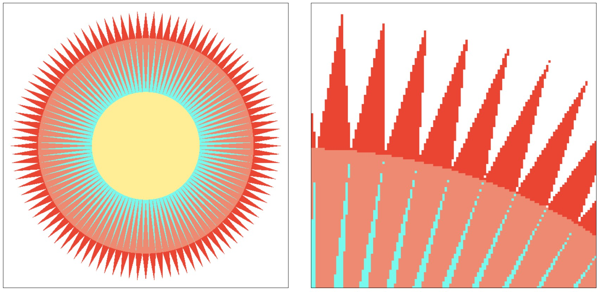
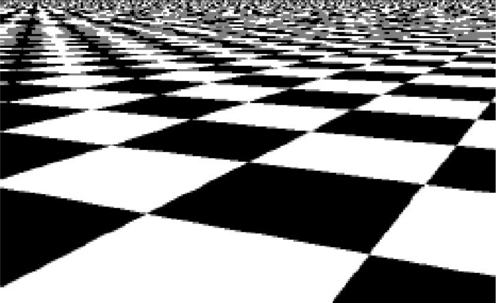
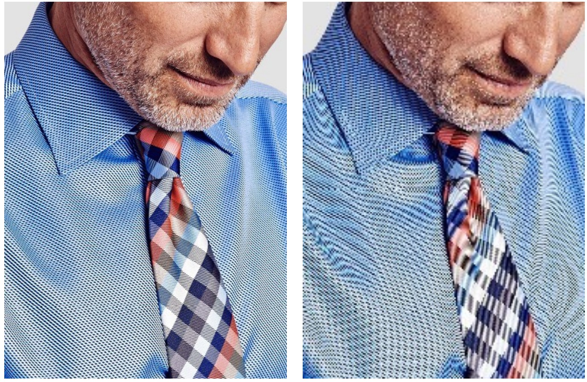

# 反走样
:label:`chap_anti-aliasing`

使用上一章 :numref:`chap_drawing-2d` 介绍的二维图形绘制方法，我们总能在边缘上看到如 :numref:`fig_aa-jaggie1` 所示的锯齿。在屏幕像素密度高的时候，图形整体看起来是连续的；而当屏幕像素比较低，或者对局部进行放大时，我们就能看到大量的影响观感的锯齿。这种现象不止发生在二维图像绘制中。如 :numref:`fig_aa-jaggie2` 所示，我们能从中看到近处棋盘格边缘的像素锯齿，而当远处的棋盘格所占的屏幕空间越来越小时，锯齿对于形状的影响越来越大，以至于将远处的棋盘格变成了一团随机噪声。在图 :numref:`fig_aa-moire` 中，我们展示了**摩尔纹（Moire pattern）**的现象。左边的图片是在高像素的情况下，我们能看到衣服和领带上的精细纹路，如果将图片缩小至低像素，就会在衣服和领带上出现原本不存在的干扰纹理。


:width:`500px`
:label:`fig_aa-jaggie1`


:width:`500px`
:label:`fig_aa-jaggie2`


:width:`500px`
:label:`fig_aa-moire`

这些锯齿、混淆、摩尔纹的不自然结果统称为**走样（Aliasing）**现象。在本质上，走样现象是我们用离散的像素近似表示连续的图形、图片时离散精度（采样频率）不够导致的。因此不管我们是在光栅化，还是处理图像，还是进行三维渲染，还是进行其他的离散化，当采样频率不够的时候就可能出现走样现象。与之对应的，为了减轻或避免走样现象的技术就称为**反走样（Anti Aliasing）**。在不同的语境下，反走样也翻译为抗锯齿、反混淆。由于走样现象无处不在，反走样技术就变得尤为重要。本章我们将使用信号采样的理论尽可能从数学本质上理解走样现象，并介绍反走样的通用方法。

````toc
:maxdepth: 2

signal-theory
aa-principle
aa-method
summary
````