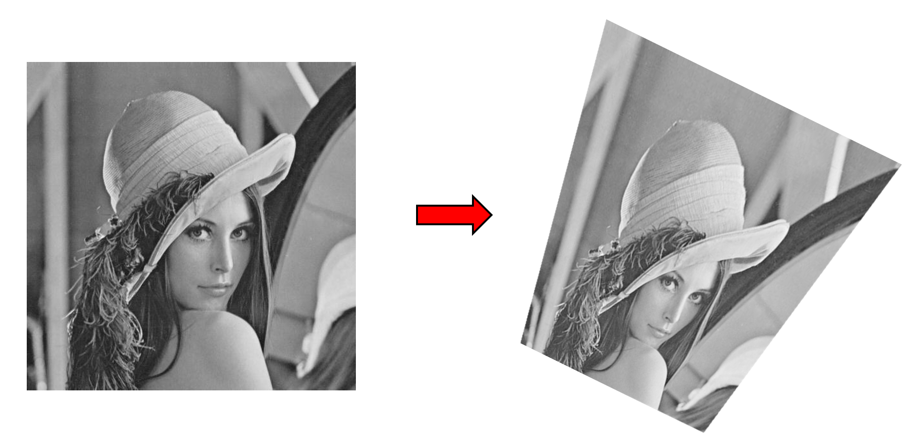
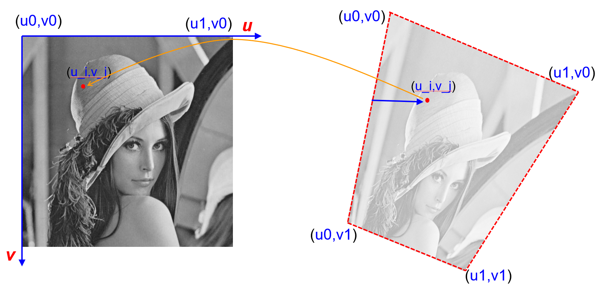
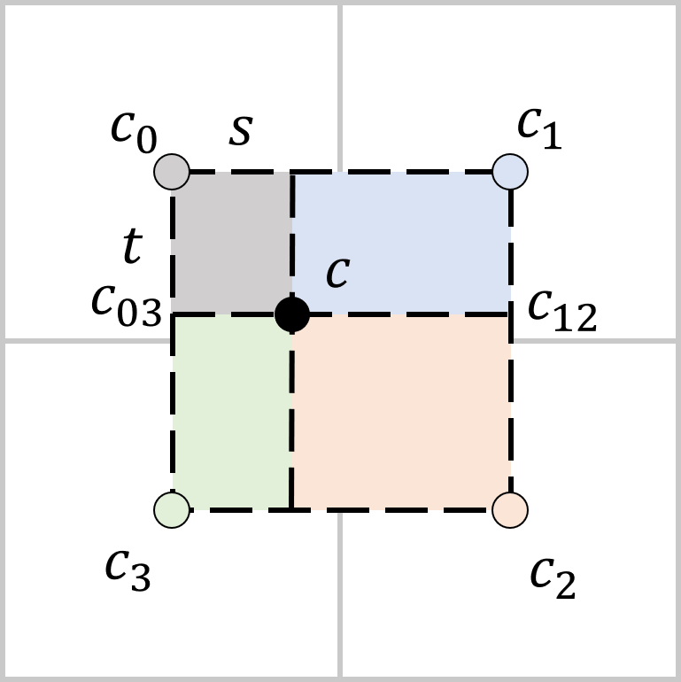
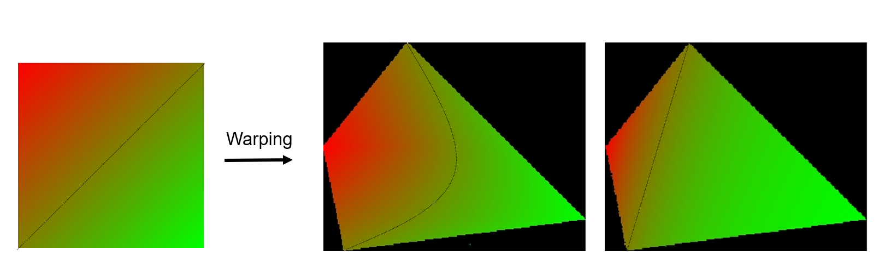

# 颜色填充

在上面介绍的算法中，我们只介绍了如何绘制纯色图形，在更一般的情况下我们希望在多边形内部填充不一样的内容。比如，我们可以指定多边形各个顶点的颜色，然后希望在多边形的内部进行颜色的插值，如图 :numref:`fig_paint-opengl` 所示。再比如，我们有一张图片，我们希望通过移动四个顶点将其拉伸成不规则的四边形，如 :numref:`fig_paint-image-warp` 所示。这种填充到多边形中的图片可以被称之为 **纹理（Texture）**，我们将在之后的三维渲染部分 :numref:`chap_texture-mapping` 进一步接触这个概念。

:width:`400px`
:label:`fig_paint-opengl`

:width:`700px`
:label:`fig_paint-image-warp`

## 颜色插值

从算法上而言，我们之前介绍的算法主要在解决需要绘制哪些像素的问题，现在需要考虑绘制什么颜色的问题。在最简单的情况下，在绘制线段时，假设我们给定了线段两端的颜色，那么中间的部分的颜色可以由线性插值给出。具体来说，假设两个顶点$(x_0, y_0)$和$(x_1, y_1)$的颜色分别为$c_0$和$c_1$，那么$(x, y)$像素点上的颜色为：

$$c = c_0 (1 - t) + c_1 t\text{, } t = \frac{x - x_0}{x_1 - x_0}$$
:eqlabel:`eq_paint-intp`

通过这种方式线段上的颜色就能从$c_0$渐变到$c_1$。在填充多边形时，我们可以通过上面介绍的扫描线算法来实现内部颜色的插值。如 :numref:`fig_paint-color-intp` 所示，在扫描线算法中，我们可以通过公式 :eqref:`eq_paint-intp` 的线性插值得到左右端点的颜色，然后再在左右端点之间再使用公式 :eqref:`eq_paint-intp` 的线性插值。这样两次线性插值的方法被称为 **双线性插值（Bi-linear Interpolation）**。

:width:`700px`
:label:`fig_paint-color-intp`

## 图像拉伸

:width:`700px`
:label:`fig_paint-uv`

对于图像填充而言，我们的问题不再是如何通过插值得到颜色，而是需要得到需要绘制的像素对应原图像的哪一个点。用数学来描述，我们可以为原图像建立一个二维坐标系，一般称之为 **UV坐标（UV Coordinate）**。原图像就是从UV坐标到颜色的映射 $(u, v) \rightarrow c$。在进行图像的拉伸变形中，顶点的UV坐标是固定的，我们只需要知道每个像素对应的UV坐标，就能通过原图像查找到对应的颜色。于是，在图像拉伸中，我们需要插值的不再是颜色，而是每个像素的UV坐标。

就像上面介绍的颜色插值一样，我们已知了多边形每个顶点的UV坐标，在扫描线算法中使用双线性插值，我们就可以得到每个像素的UV坐标$(u_i, v_i)$。理论上我们在原图像上查找$(u_i, v_i)$对应的颜色$c$就可以绘制到对应像素了，但是由于原图像也是离散的像素表示，而$(u_i, v_i)$是插值的结果，因此可能出现$(u_i, v_i)$落在两个像素之间的情况。这时最简单的做法，就是我们直接取$(u_i, v_i)$最近的像素颜色。而为了得到更平滑的结果我们也可以在纹理图像中再进行一次双线性插值得到$(u_i, v_i)$坐标对应的颜色。

:width:`400px`
:label:`fig_paint-bilinear`

当我们查询的点位于纹理像素$c_0, c_1, c_2, c_3$构成的正方形中时，我们可以求得其相对左上角的像素在水平和竖直方向占正方形边长的比例$s$和$t$，然后在两个方向各做一次线性插值。假设我们先做竖直方向的插值，可以得到两个端点的颜色$c_{03}=tc_0 + (1-t)c_3$，$c_{12}=tc_1+(1-t)c_2$。然后再做水平方向的插值，就得到了查询点的颜色：

$$c = (1-t)(1-s)c_0 + (1-t)sc_1 + (1-s)tc_3 + stc_2$$
:eqlabel:`eq_paint-bilinear-intp`

如果先做水平方向的插值，后做竖直方向的插值我们将会得到和公式 :eqref:`eq_paint-bilinear-intp` 一样的结果。从结果可以看出，最终插值得到的颜色可以看成是四个端点颜色的加权平均，权重就是 :numref:`fig_paint-bilinear` 中对应矩形的面积。

尽管我们这里介绍的纹理填充方法非常简单直接，但是需要注意纹理填充、图像拉伸并不是一个简单的课题，我们这里介绍的方法也不是唯一的方法。如 :numref:`fig_paint-different-warping` 所示，右边两个结果都是合理的插值结果，但是两种颜色的比重完全不同。在不同的场景下，我们需要根据目标的不同进行选择。在之后的三维渲染 :numref:`chap_shading` 中我们还会更细致地研究插值相关的问题。

:width:`700px`
:label:`fig_paint-different-warping`