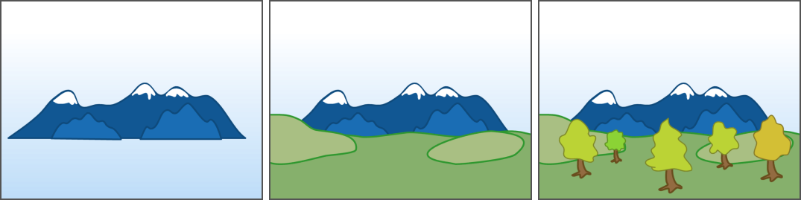
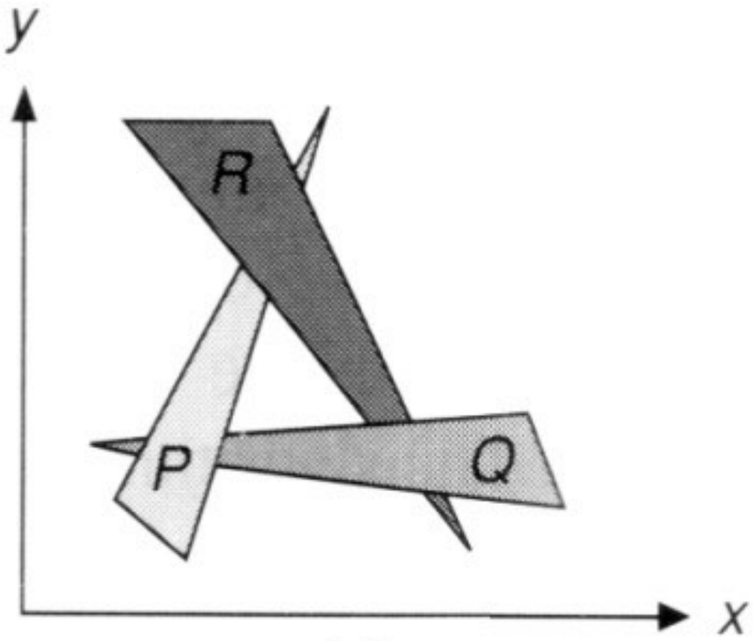

# 合成

我们现在可以在画板上绘制出直线、圆、三角形、多边形等基础图形，距离一幅真正的画作就差把它们合成到一起了。在合成中我们最需要解决的问题是**可见性（Visibility）**的问题，也就是如何决定谁覆盖在谁之上的问题。每个图形除了定义形状的参数外，我们还可以增加一个深度$z$，$z$越小表示离我们越近，越大表示离我们越远。那么自然想到，我们可以对所有的图形深度进行排序，然后按照从后向前的顺序依次绘制每个图形。这个绘制方法和画家画画的方式是一样的，先绘制远景，然后再画近景，因此被称为**画家算法（Painter's Algorithm）**。


:width:`500px`
:label:`fig_paint-painter`

在大多数情况下，画家算法可以得到正确结果。然而在某些特殊的情况下，画家算法会失效。如 :numref:`fig_paint-painter1` 所示的情况，三个三角形相互交叠在一起，并不能定义简单的前后关系。这种情况主要会发生在三维空间中，想象三个三角形相互穿插在一起，三角形上的每个点的深度其实并不是一个常数。


:width:`500px`
:label:`fig_paint-painter1`

为了处理这种情况，我们引入一个非常重要的算法，**深度缓存算法（Z-buffer）**。深度缓存算法在每个像素上额外储存了像素的深度值，如果当前绘制的图形的深度小于像素的深度，我们就覆盖像素的颜色，并更新像素的深度。其伪代码如下：

```{.python}
# 初始化深度缓存为无穷远
depth_buffer = initialize_depth_buffer()

# 对于所有需要绘制的图形
for shape in shapes:
  # 对于图形中的所有像素
  for pixel in shape:
    # 获取图形对应像素的深度
    depth = get_shape_depth(pixel)
    # 进行深度检测
    if depth < depth_buffer[pixel]:
      draw(shape, pixel)
      depth_buffer[pixel] = depth
```

尽管深度缓存算法描述起来非常简单，但是实际的效果非常好。相比于画家算法需要$O(n\log n)$的时间对所有图形进行排序，深度缓存只需要$O(n)$的复杂度，对绘制顺序也没有要求，额外的开销只是需要在每个像素上记录最小深度。在后面的三维光栅化部分（ :numref:`chap_shading` ），我们能看到深度缓存技术继续发挥重大作用。


