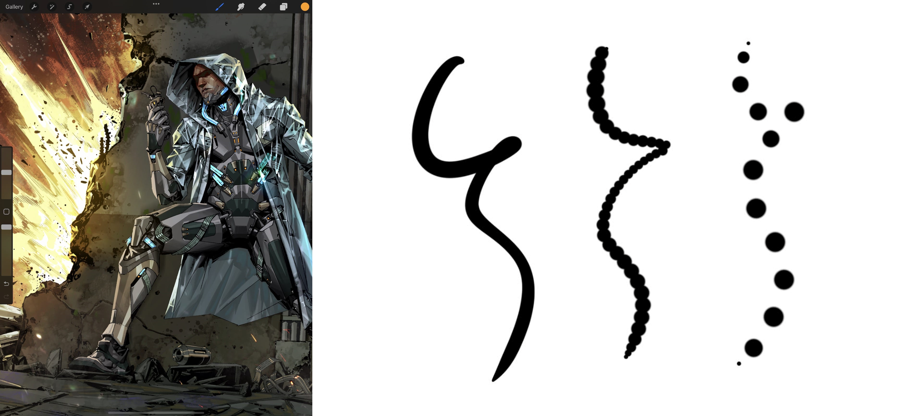
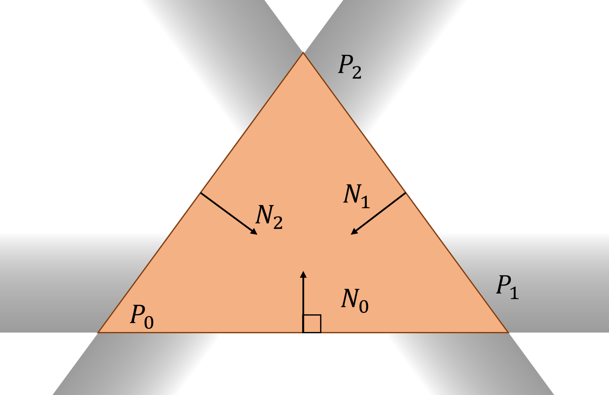

# 光栅化

在显示设备章节我们了解到现代的显示设备都是基于点阵像素的显示方式，而在描述形状的时候我们往往使用的是参数化的连续表示，比如用斜率$m$和截距$b$表示直线，用圆心$p$和半径$r$表示圆，将参数表示的图形转换为可显示的点阵图的过程称为**光栅化(Rasterization)**。

> 在之后的渲染章节 :numref:`chap_rendering-basics` 我们还会遇到“光栅化”，在那里光栅化用来指代一种区别于光线追踪的三维渲染方式，其基础就是在这里介绍的二维的光栅化算法。


:width:`500px`
:label:`fig_paint-rast`

光栅化对于图形绘制是非常重要的底层算法。打开电脑的画图软件我们能看到非常丰富的笔刷、形状工具，通过大量的笔触层层叠加我们可以绘制出非常复杂的图形。单独将一个圆画笔的笔触拆分看来，我们可以发现计算机其实是在笔触的路径上生成了一系列离散的圆来模拟光滑的笔触，每一个圆都需要通过光栅化绘制到画板上。由此可见，光栅化算法会在底层大量调用，因此需要非常高效的实现和硬件来加速绘制，在现代计算机上这一过程会优化到指令级。


:width:`500px`
:label:`fig_paint-stroke`

下面我们将从直线开始，介绍简单几何图形的光栅化经典算法。曲线图形的光栅化将在后面的曲线章节 :numref:`chap_curves` 单独介绍。

## 直线

假设我们有一块$N$行$M$列的屏幕，在屏幕空间里我们建立坐标系，左下角像素中心为零点，右上角像素中心的坐标为$(M-1,N-1)$，在这个坐标系中我们希望绘制方程为$y(x)=mx+b$的直线段，从$(x_0, y_0)$到$(x_1, y_1)$，满足$y_0=y(x_0)$，$y_1=y(x_1)$。为了讨论方便，我们首先假设$0<m<1$，并且$x_0 < x_1$，在最后再考虑其他情况的处理。最终实现的效果如 :numref:`fig_paint-line` 所示。


:width:`500px`
:label:`fig_paint-line`

在最简单的想法下，我们可以遍历横坐标从$x_0$到$x_1$，根据方程计算出对应的$y$，然后绘制对应像素。

```{.python}
def draw_line(x0:int, x1:int, m:float, b:float):
  for x in range(x0, x1 + 1):
    y = m * x + b
    draw_pixel(x, Round(y))
```

这样做并没有任何错误，但是效率可以进一步提高。在计算每个像素的位置时，我们主要的时间花费在了浮点数乘法、加法以及取整运算。由于我们是等间隔采样直线上的点，自然想到可以使用累加代替乘法操作，这样就得到了绘制直线的**DDA(Differential Digital Analyzer)**算法。

```{.python}
def draw_line(x0: int, y0: int, x1: int, y1: int):
  y = y0
  m = (y1 - y0) / (x1 - x0)
  for x in range(x0, x1 + 1):
    draw_pixel(x, Round(y))
    y += m
```

在DDA算法中，我们成功在循环中去掉了浮点数乘法操作，仅保留了加法和取整。接下来的问题是，在DDA的基础上我们还能在哪里优化计算效率？一个重要的观察是，尽管直线方程是用实数表示的方程，但是我们最终只需要在屏幕上画出离散的像素点，这些像素的点的位置是可以只用整数进行表示的。由于浮点数的表示和精度问题，浮点数的运算时间通常是要比整数更慢的，在早期的计算机上尤为明显。Jack Elton Bresenham教授在1962年提出了著名的**布雷森汉姆直线算法（Bresenham's Line Algorithm）**，能够在每个像素点上只计算整数加减法的情况下获得和 DDA
算法相同的结果。布雷森汉姆直线算法的基本思想同DDA算法一样也是累加。观察 :numref:`fig_paint-line` 的结果，在整数空间累加的关键在于判断何时在y坐标上加1，从而用一段段长短不一的水平的像素模拟出一条倾斜的直线。换言之，假设我们已经在$(x,y)$处（这里$x$，$y$均为整数）画出了一个像素，算法需要确定下一个像素是画在$(x+1, y)$处还是$(x+1, y+1)$处。


:width:`500px`
:label:`fig_paint-br2`

布雷森汉姆直线算法为这个判断提出了一个简洁的准则：当点$(x+1,y+1/2)$位于直线的上方时，我们应该选择像素点$(x+1,y)$，反之选择$(x+1,y+1)$。这个选择方式保证了在$0<m<1$时，我们所绘制的像素点在y方向上与直线最多相差$0.5$个像素单位，于是从$x_0$绘制到$x_1$就能得到整条直线的光栅化结果。


:width:`500px`
:label:`fig_paint-br1`

判断点在直线的哪一侧可以通过直线的隐式方程得到。如 :numref:`fig_paint-br1` 所示，定义向量$N$垂直于经过$P_0$和$P_1$的直线，对于任意一点$P$，直线的隐式方程定义为$F(P):=N\cdot(P-P_0)$。当$F<0$时，$P$点位于直线上方，当$F>0$时位于直线下方，$F=0$时点$P$在直线上。注意到隐式方程中包含了点乘操作，直接代入$(x+1,y+1/2)$还是需要求乘法。与DDA算法类似，我们使用累加的方法计算$F(P)$来避免乘法。具体来说，假设我们已经知道了$P=(x,y)$点处的$F(P)$，$P+\Delta=(x,y)+(1,1/2)=(x+1,y+1/2)$处的值可以表示为

$$F(P+\Delta) = N\cdot(P+\Delta-P_0) = N\cdot(P-P_0) + N\cdot\Delta = F(P) + N\cdot \Delta$$
:eqlabel:`eq_paint-F`

在这个结果中，$N\cdot\Delta$是跟坐标无关的定值，这表示我们确实可以通过累加的方法得到$(x+1,y+1/2)$处的$F$。这个推导同样适用于$\Delta=(1,0)$和$\Delta=(1,1)$的情况，因此我们可以通过累加的方式确定直线路径上每个像素点的$F$。

在上面的推导中我们暂时忽略了所有计算都必须是整数计算的要求。为了保证在$\Delta=(1,0),(1,1/2),(1,1)$的情况下都得到整数的结果，我们可以选择$N=(2(y_1-y_0), -2(x_1-x_0))$，能够满足与直线垂直，并且$N\cdot\Delta$的结果都为整数。

基于上面的推导，布雷森汉姆直线算法的代码如下所示：

```{.python}
def draw_line(x0: int, y0: int, x1: int, y1: int):
  y = y0
  dx, dy = 2 * (x1 - x0), 2 * (y1 - y0)
  dydx, F = dy - dx, dy - dx // 2
  for x in range(x0, x1 + 1):
    draw_pixel(x, y)
    if F < 0: 
      F += dy
    else:
      y += 1
      F += dydx
```

最后我们还剩下了一点东西没有讨论，就是$0<m<1$的限制条件。这个条件保证了在x坐标增加1时，y坐标最多只需要增加1，可以想象当$m>1$时，有可能x坐标增加1，我们需要在竖直方向连续画多个像素。为了画出任意方向的直线，我们需要将斜率按照 :numref:`fig_paint-br3` 的8中情况进行分类讨论。在每种情况中，我们选择直线最贴近的坐标轴进行遍历，并考虑另外一个坐标轴需要累加还是累减，但算法的本质并没有任何区别。这里我们就不给出完整的8种情况的布雷森汉姆直线算法，留给读者自行实现。


:width:`500px`
:label:`fig_paint-br3`

布雷森汉姆直线算法是最经典、应用最广泛的直线光栅化算法，存在非常多的变体。一个自然的推广是，我们已知圆的隐式函数为$F(P)=|P-P_0|^2 - r^2$，因此可以尝试用类似布雷森汉姆直线算法中的累加方法绘制圆，这一过程与布雷森汉姆直线算法类似，在wikipedia中也有具体[推导](https://en.wikipedia.org/wiki/Midpoint_circle_algorithm#Algorithm)。在上面的讨论中，我们默认线的宽度为一个像素，Alan Murphy在1978年对布雷森汉姆直线算法做出了[改进](http://www.zoo.co.uk/murphy/thickline/)，使之能够绘制有宽度的直线。在现代计算机上，布雷森汉姆直线算法并不是唯一的选择，比如吴小林教授在1991年提出的**吴小林直线算法（Xiaolin Wu's Line Algorithm）** :cite:`wu1991line` 可以实现带反走样的直线光栅化。我们将在 :numref:`chap_anti-aliasing` 重点介绍反走样这一概念。


## 多边形

与绘制线不同，绘制多边形需要对多边形的内部进行填充。我们还是从简单的三角形开始，并且只考虑纯色填充，分析如何进行多边形的光栅化。三角形对于计算机图形学来说非常重要。任意一个二维多边形都可以切割成多个三角形的组合，同时三角形也是三维模型的重要组成部分 （ :numref:`chap_geometric-representation` ）。

我们考虑绘制由$P_0=(x_0, y_1)$，$P_1=(x_1, y_1)$，$P_2=(x_2, y_2)$三个顶点定义的三角形，三个顶点保证逆时针顺序。在最简单的想法下，我们可以判断每个像素是否在三角形内部，如果是就绘制颜色。

```{.python}
def draw_triangle(x0: int, y0:int, x1:int, y1:int, x2:int, y2:int):
  xmin, xmax = min(x0, x1, x2), max(x0, x1, x2)
  ymin, ymax = min(y0, y1, y2), max(y0, y1, y2)
  for x in range(xmin, xmax + 1):
    for y in range(ymin, ymax + 1):
      if inside(x, y, x0, y0, x1, y1, x2, y2):
        draw(x, y)
```

那么如何判断点$P=(x,y)$是否在三角形内部？我们可以借助上面提到的直线的隐式函数。如 :numref:`fig_paint-triangle-test` 所示，我们规定边的方向为逆时针方向，也就是从$P_i$指向$P_{i+1}$（$P_2$指向$P_0$），将其逆时针旋转90度得到垂直于边的法向$N_i$，那么$N_i$一定指向三角形的内部。如果点$P$位于三条边的法向一侧，也就是代入三条边的隐式方程$F_i(P)$都大于0，那么点$P$就位于三角形内部。反之如果有任意一条边的$F_i(P)<0$，那么点$P$就位于三角形的外部。


:width:`500px`
:label:`fig_paint-triangle-test`

这里我们遇到了和直线绘制中类似的情况。这个算法并没有什么问题，但是每个点都需要计算三次直线的隐式方程，包含整数乘法运算，有没有可能通过累加的方式避免乘法运算呢？


:width:`500px`
:label:`fig_paint-poly1`

观察最简单的三角形绘制算法，我们其实是在一行一行地绘制三角形中的像素。如果已知三角形在一行中的左边端点$y_L$和右边端点$y_R$，中间的像素其实没有必要进行内外检测，可以直接绘制。而维护左右端点的过程其实就是在绘制直线的过程。我们没有必要重复计算三条边与当前行的交点，而是可以通过上一行的交点和直线的斜率，增量更新到当前行的交点，这正是绘制直线的DDA算法。通过这种方式我们能够避免对所有像素进行三角形内外检测，而只通过增量更新的方法逐行绘制，这种算法被称为**扫描线算法（Sweep-Line Algorithm）**。这里我们仅给出大致的伪代码：

```{.python}
def draw_triangle(T):
  for each edge pair:
  initialize x_L, x_R
  compute dx_L/dy_L, dx_R/dy_R
  for each scanline at y:
    for x in range(x_L, x_R + 1): draw(x, y)
    x_L += dx_L/dy_L
    x_R += dx_R/dy_R
```

扫描线算法的想法可以自然拓展到多边形中。我们可以首先对多边形的所有边进行排序，然后用类似方法维护左右交点，从上到下进行扫描线的绘制。在面对多边形时，我们还要额外注意多边形非凸的情况。如 :numref:`fig_paint-poly1` 所示，一条扫描线有可能和多边形有不只两个交点。为了处理这种情况，我们可以将所有边与扫描线的交点从左到右排序，可以发现第奇数交点到第偶数交点中间就是需要绘制的像素，而第偶数交点到第奇数交点之间是在多边形外部的区域。


:width:`500px`
:label:`fig_paint-poly2`

扫描线算法相比于简单的三角形算法更高效，然而在现代计算机上，其实使用的最多的是并行版的简单算法。这背后的原因在于，三角形在现代图形学中的地位非常重要，在后面的学习中我们会发现现代的渲染管线是完全围绕三角形搭建起来的，现代显卡的重要功能就是绘制三角形。为了能够快速绘制大量的三角形，现代显卡基本都会提供三角形内外检测的专门硬件模块，从而在硬件上实现并行的三角形绘制。